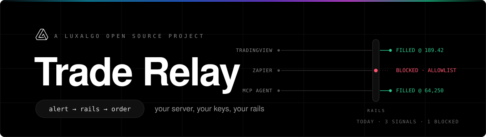
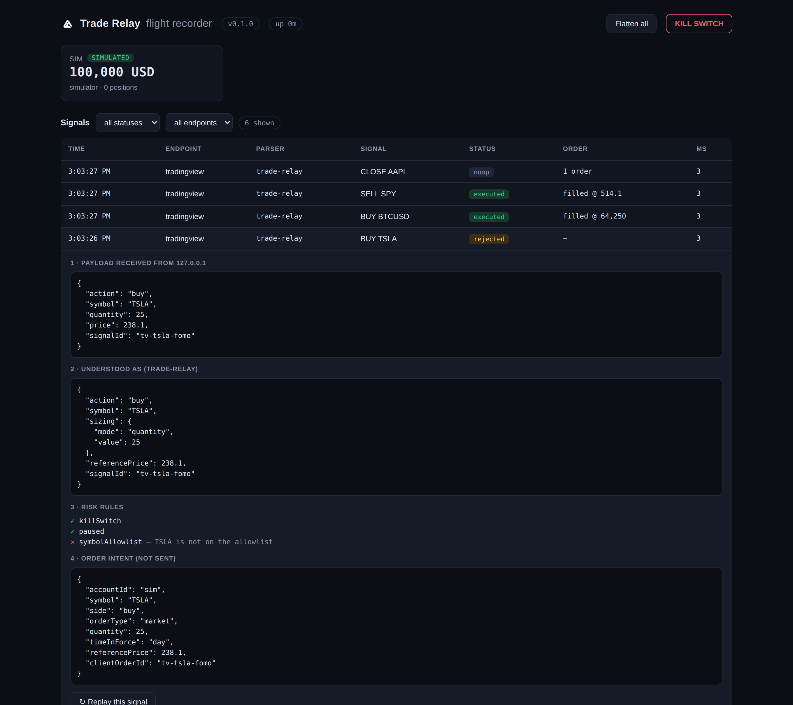
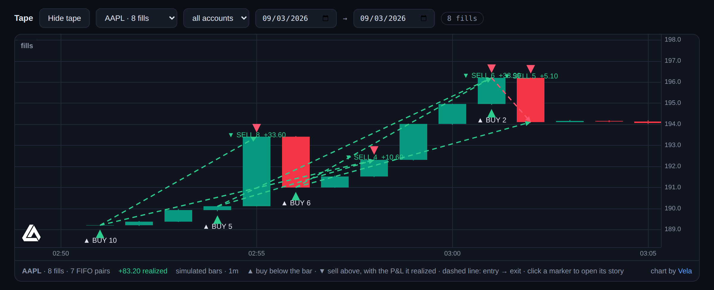

<p align="center">
  
</p>

<p align="center">
  <a href="https://github.com/LuxAlgo/trade-relay/actions/workflows/ci.yml"></a>
  <a href="LICENSE"></a>
  <a href="package.json"></a>
</p>

<p align="center">
  <a href="docs/payload.md"><b>Payload</b></a>
  &nbsp;·&nbsp;
  <a href="docs/safety.md"><b>Safety rails</b></a>
  &nbsp;·&nbsp;
  <a href="docs/deploy.md"><b>Deploy</b></a>
  &nbsp;·&nbsp;
  <a href="docs/mcp.md"><b>AI agents</b></a>
  &nbsp;·&nbsp;
  <a href="docs/migrate-traderspost.md"><b>Migrate from TradersPost</b></a>
  &nbsp;·&nbsp;
  <a href="docs/migrate-signalstack.md"><b>Migrate from SignalStack</b></a>
</p>

**Trade Relay is a self-hosted relay between trading alerts and real broker accounts.** Point a TradingView alert, a Zapier zap, an AI agent, or anything that can send a webhook at your own deployment. It parses the alert, runs it through risk rails that are on by default, places the order at your broker with your own keys, and records the entire story locally.

It runs as one small Node process with a single SQLite file: no external services, no account with anyone, no telemetry. Trade Relay is a [LuxAlgo](https://luxalgo.com) open-source project and this is the official repository.

## Five minutes to a filled order

```bash
mkdir my-relay && cd my-relay
npx @luxalgo/trade-relay init     # config + generated secrets
npx @luxalgo/trade-relay start    # webhook + dashboard on :8484
```

Paste this into a TradingView alert message and point the alert at your webhook URL:

```json
{ "action": "buy", "symbol": "{{ticker}}", "quantity": 1, "price": "{{close}}" }
```

Fire it, then open the dashboard:

<p align="center">
  
</p>

Every signal becomes a story with nothing hidden: the raw payload, what the parser understood it to mean, every risk rule's verdict with its reason, the order that went out, and what the broker answered. Any captured payload replays against paper with one click. It all lives in a SQLite file next to the process. Nothing phones home, ever.

Running from a clone instead: `pnpm install && pnpm build`, then `node dist/cli.js init && node dist/cli.js start`.

## Fills on the tape

The same stories, read as a chart. The dashboard's **Tape** panel picks a symbol from the fills the flight recorder holds and draws where Trade Relay's orders actually filled: a green triangle below the bar for every buy, a red one above it for every sell, each with its size, and a dashed line from entry to exit with the realized P&L wherever the FIFO matching can pair them (the same rules as the stats cards, from broker-sdk: buys open lots, sells close the oldest first, a sell with no recorded entry stays an unpaired marker). Click a marker and the signal's story opens in the table below, so a fill on the chart is always one click from its payload, its risk decisions, and the broker's answer.

<p align="center">
  
  <br><sub>The built-in simulator, a few signals fired through the webhook. The candles are the simulator's <b>simulated bars</b>, drawn from the prices those signals carried; no market data was involved.</sub>
</p>

Where the candles come from, and the panel always says which:

- **Simulator** — the simulator is the price process behind every simulated fill, so it draws its own one-minute bars: they start at the first signal's price, hit every price a signal carried at the moment it arrived, and follow a seeded walk in between. Deterministic, and labelled *simulated bars*.
- **Real brokers** — bars come through [`@luxalgo/broker-sdk`](https://github.com/LuxAlgo/broker-sdk), never from broker code in this repo. The port picks up the SDK's `fetchBars` (Alpaca and Tradier) the moment an SDK release ships it; until then those accounts have no bars and the panel says so.
- **Crypto pairs** — when the server has no bars, the browser may chart real public candles from Vela's bundled keyless Binance or Coinbase providers, labelled *Binance public data* and so on; if the feed is unreachable, the chart falls back.
- **Otherwise the fill path** — the fills themselves as the price series, labelled *fill path, no market data*. The relay never fabricates a candle it did not see.

The chart is drawn in the browser by [Vela](https://github.com/LuxAlgo/Vela), LuxAlgo's open-source charting library, shipped inside this package and served from your relay's own origin: nothing is fetched from a CDN, and the script only loads when you open the panel. The data behind it is one Bearer-protected call, `GET /api/tape/:symbol?from=&to=`, whose `bars`, `barsSource` and `barsTimeframe` fields carry whichever source applied.

## The rails are the product

Every rail below is enforced by the engine, ships on, and can only be loosened by a flag whose name admits what it does. A config that neither sets a rail nor loosens it fails to boot.

| Rail | Default behavior |
| --- | --- |
| Symbol allowlist | Only trades what you listed. Exits are always allowed |
| Max position size | Checked on the projected position after the fill. Cannot verify it, cannot trade |
| Max daily loss | Past the cutoff, only risk-reducing orders pass until tomorrow |
| Duplicate protection | The same alert firing twice cannot double your position |
| Trading hours | Timezone-aware windows. Exits exempt |
| Orders per day | Runaway-loop ceiling, default 100 |
| Kill switch | One action stops everything, everywhere. Survives restarts, only an explicit resume clears it |

The kill switch is a dashboard button, an API call, a webhook payload (`{"action": "kill"}`), and an MCP tool. Details and the reasoning: [docs/safety.md](docs/safety.md).

## The payload you already use

The native format covers most needs in one JSON shape: actions (`buy`, `sell`, `close`, `flatten`, `cancel_all`, `kill`), four sizing modes (quantity, currency amount, percent of equity, risk percent), order types up to trailing stops and take-profit/stop-loss brackets, idempotency keys. Reference: [docs/payload.md](docs/payload.md).

Already sending alerts somewhere else? Migration is changing one URL. TradersPost-format payloads (`ticker`, `action`, `sentiment`, object-shaped exits) and SignalStack-style JSON and plain text (`BUY 10 AAPL`) are detected and honored as-is.

## Built for agents, not just alerts

The relay is also an MCP server. Claude or any MCP client can read positions, read the flight recorder ("why was my last signal rejected?"), and throw the kill switch. Trading through MCP exists only when a human sets `mcp.allowTrading: true`, and an agent's order travels the exact same risk pipeline as a webhook. No special paths.

```jsonc
{ "mcpServers": { "trade-relay": { "command": "npx", "args": ["trade-relay", "mcp"] } } }
```

For hosted agents and integrations there is a separate **agent token**: a revocable key with a scope you control, read-only by default, so your master token never leaves your hands. Built for TradingView alerts, and for the agents that come after them: [docs/mcp.md](docs/mcp.md).

## Brokers

All broker connectivity goes through [`@luxalgo/broker-sdk`](https://github.com/LuxAlgo/broker-sdk), the open-source broker layer. Trade Relay never speaks a broker's REST dialect itself, and it never emulates a missing capability against a real account.

| Account | Status |
| --- | --- |
| Built-in simulator | Everything works here: stops, trailing stops, OCO brackets. Zero keys needed |
| Alpaca paper | Market and limit orders, notional sizing, idempotent |
| Alpaca live | Only when your config carries the SDK's exact acknowledgement sentence, typed by you |
| Tradier sandbox | Market and limit equity orders. Live is impossible by construction |
| Kraken, OKX, IBKR, Hyperliquid, +10 more | Watch-only portfolio view in the dashboard |

More brokers and order types arrive upstream first; the standing asks are public in [docs/broker-sdk-proposal.md](docs/broker-sdk-proposal.md). The recommended path is unchanged whatever the broker: simulate, then paper, then decide.

## Deploy

A single Node process (22.13 or newer) and one SQLite file. Docker image and compose file included, Railway template included, or run it on a laptop behind any tunnel. Honest notes on what we do not recommend yet (serverless) and why: [docs/deploy.md](docs/deploy.md).

## What it refuses to do

No hosted version: your keys and your orders stay on infrastructure you control. No custody, keys live in your environment. No strategy advice, it executes what it is told. No unofficial broker APIs, which is why there is no Robinhood. No telemetry, and the absence is the feature.

## Contributing

`pnpm install && pnpm check` runs everything locally, simulator included, no keys needed. Broker coverage grows upstream in [broker-sdk](https://github.com/LuxAlgo/broker-sdk); parsers, rails, dashboard, and docs grow here. See [CONTRIBUTING.md](CONTRIBUTING.md). Vulnerabilities go to [SECURITY.md](SECURITY.md), not the issue tracker.

## License

MIT, see [LICENSE](LICENSE). The published package also ships [Vela](https://github.com/LuxAlgo/Vela) (Apache-2.0) for the dashboard's chart; its notice is reproduced in [THIRD_PARTY_NOTICES.md](THIRD_PARTY_NOTICES.md).

## Disclaimer

Trade Relay executes instructions you configure. It never recommends trades and nothing here is financial advice. Trading involves substantial risk of loss. You operate this software, your broker relationship is yours, and you are responsible for what your deployment does. No warranty; see [LICENSE](LICENSE).

---

<p align="center">
  <sub>MIT © <a href="https://luxalgo.com">LuxAlgo</a> · <a href="TRADEMARKS.md">Trademarks</a> · <a href="SECURITY.md">Security</a> · <a href="CHANGELOG.md">Changelog</a></sub>
</p>
